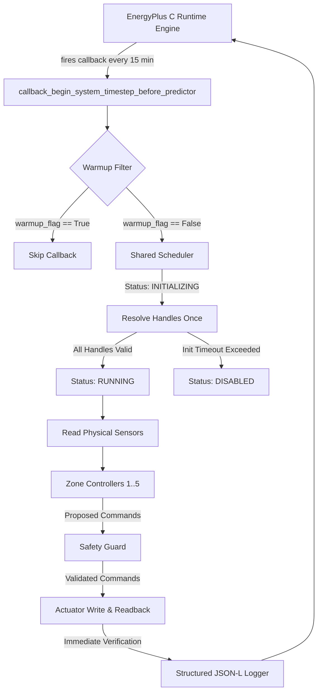
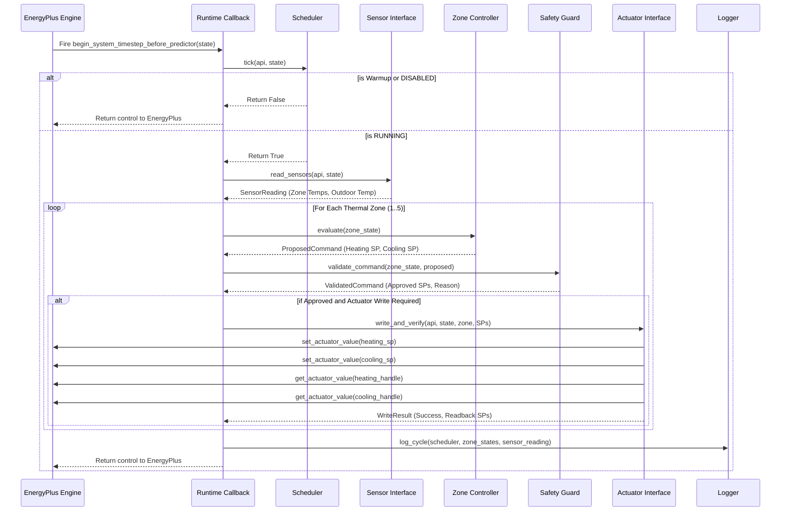

# Architecture Specification

## Overview

EcoAgent is structured around an in-process simulation loop leveraging the PyEnergyPlus C-API (`pyenergyplus.api.EnergyPlusAPI`). Rather than running EnergyPlus as an external subprocess with post-hoc CSV analysis, EcoAgent registers Python callbacks that execute inside the EnergyPlus C runtime loop at 15-minute simulated intervals.

---

## System Architecture Diagram

---

## Callback Execution Lifecycle

The primary integration point is `callback_begin_system_timestep_before_predictor`. This callback fires at the start of each system timestep, after zone temperature heat balance calculations are complete but **before** EnergyPlus computes zone load predictions and dispatches HVAC equipment controllers.

### Lifecycle Sequence

---

## EnergyPlus C-API Integration

The C-API interface is managed by `ecoagent.simulation.EnergyPlusRunner`. 

### Key C-API Interaction Rules

1. **State Isolation**: Simulation state is managed via `api.state_manager.new_state()` and deleted with `delete_state(state)` upon completion.
2. **Data Availability Gate**: Handles are queried only after `api.exchange.api_data_fully_ready(state)` returns `True`.
3. **In-Process Memory Access**: Setpoint writes (`set_actuator_value`) update EnergyPlus internal setpoint arrays immediately within C memory space.

---

## Controller Pipeline Architecture

The controller pipeline enforces a strict unidirectional control flow:

1. **Sensors** read zone temperatures and ambient environment conditions.
2. **Zone Controllers** evaluate zone temperatures against the fixed comfort band [21.5, 24.5]°C and propose setpoint shifts.
3. **Safety Guard** validates proposed commands against hard numerical bounds, minimum deadbands, and dwell times.
4. **Actuator Layer** issues C-API writes and performs immediate readback verification.
5. **Logger** records cycle metadata and zone telemetry to disk.

No component can bypass the Safety Guard to write directly to actuators.
