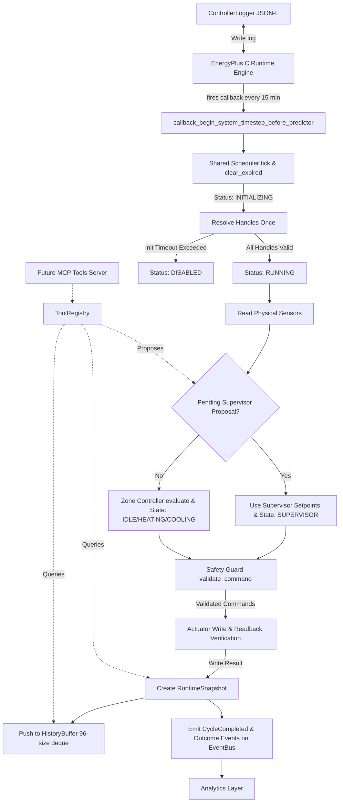
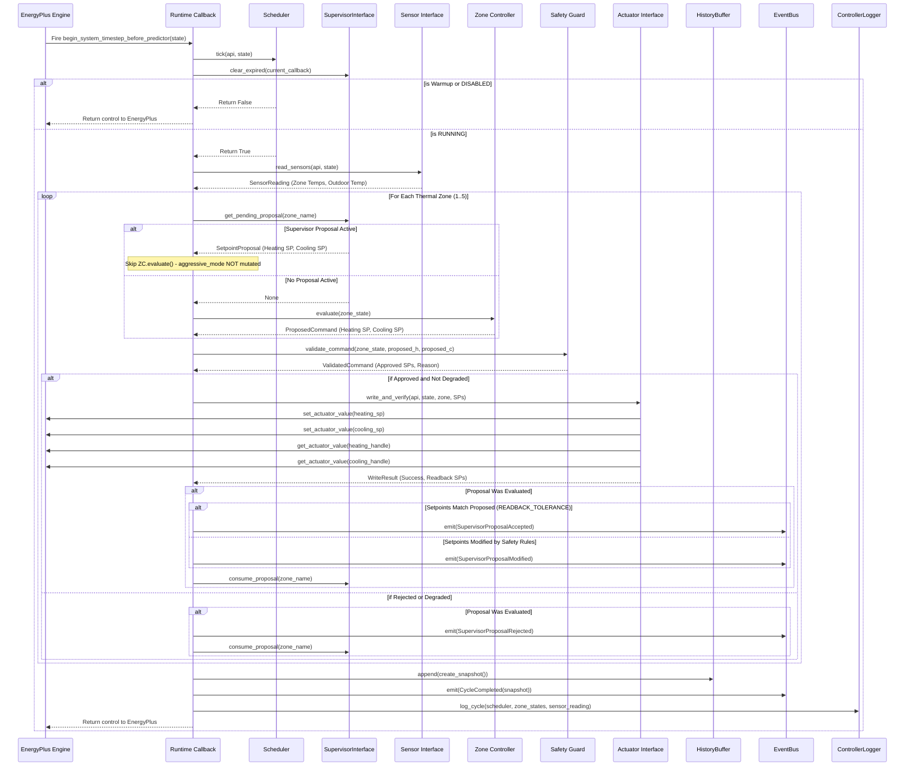

# Architecture Specification

## Overview

EcoAgent is structured around an in-process simulation loop leveraging the PyEnergyPlus C-API (`pyenergyplus.api.EnergyPlusAPI`). Rather than running EnergyPlus as an external subprocess with post-hoc CSV analysis, EcoAgent registers Python callbacks that execute inside the EnergyPlus C runtime loop at 15-minute simulated intervals.

The architecture comprises two primary layers:
1. **Deterministic Control Layer (Phase 2 Baseline)**: Scheduler, sensor reading, deterministic state machines, safety guard validation, actuator writing, and readback verification.
2. **Supervisory Infrastructure Layer (Phase 3 Baseline)**: Advisory proposal tracking, runtime snapshotting, bounded history buffering, synchronous event emission, analytics computation, and internal tool registry.

---

## System Architecture Diagram

---

## Callback Execution Lifecycle

The primary integration point is `callback_begin_system_timestep_before_predictor`. This callback fires at the start of each system timestep, after zone temperature heat balance calculations are complete but **before** EnergyPlus computes zone load predictions and dispatches HVAC equipment controllers.

### Complete Lifecycle Sequence Diagram

---

## EnergyPlus C-API Integration

The C-API interface is managed by `ecoagent.simulation.EnergyPlusRunner`. 

### Key C-API Interaction Rules

1. **State Isolation**: Simulation state is managed via `api.state_manager.new_state()` and deleted with `delete_state(state)` upon completion.
2. **Data Availability Gate**: Handles are queried only after `api.exchange.api_data_fully_ready(state)` returns `True`.
3. **In-Process Memory Access**: Setpoint writes (`set_actuator_value`) update EnergyPlus internal setpoint arrays immediately within C memory space.

---

## Pipeline Structural Boundaries

The control pipeline enforces strict structural authority boundaries:

1. **Sensors** read physical environment data.
2. **Supervisor Pre-Check** checks for pending advisory proposals. If present, deterministic evaluation is skipped for that zone to prevent phantom state mutations.
3. **Zone Controllers** evaluate zone temperatures against the comfort band [21.5, 24.5]°C if no supervisor proposal exists.
4. **Safety Guard** validates all proposed commands against hard numerical bounds, deadbands, dwell timers, and critical boundary clamps.
5. **Actuator Layer** issues C-API writes and performs immediate readback verification.
6. **Telemetry & Event Layer** creates `RuntimeSnapshot`, updates `HistoryBuffer`, emits events to `EventBus`, and appends JSON-lines telemetry.

No external component can bypass the Safety Guard to write directly to actuators.
