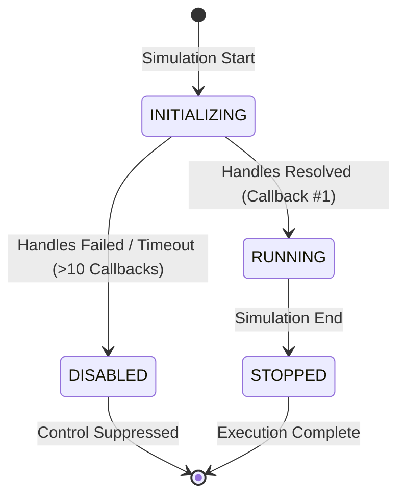
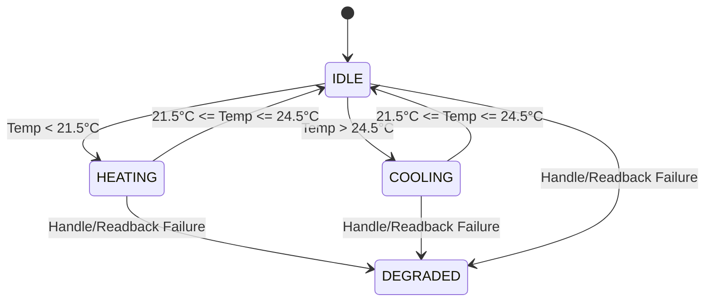

# Controller Design Specification

## Overview

The EcoAgent Phase 2 controller is a rule-based, multi-zone deterministic setpoint optimization package. It contains five independent zone controller instances coordinated by a shared runtime scheduler and validated by an immutable Safety Guard layer.

---

## Component Responsibilities

| Component | Class / Module | Responsibilities |
| :--- | :--- | :--- |
| **Scheduler** | `ecoagent.controller.scheduler.Scheduler` | Tracks callback counter, simulation clock, warmup status, and initialization state machine. Filters warmup callbacks. |
| **Zone State** | `ecoagent.controller.zone_state.ZoneState` | Maintains independent mutable state for a single zone (temperatures, current setpoints, dwell timers, saturation flags, degraded status). |
| **Zone Controller** | `ecoagent.controller.zone_controller.ZoneController` | Evaluates zone temperature against comfort boundaries. Computes magnitude-scaled setpoint step changes with hysteresis. |
| **Safety Guard** | `ecoagent.controller.safety_guard.validate_command` | Pure function enforcing hard safety bounds, minimum deadband, dwell timers, and critical temperature clamps. |
| **Actuator Manager** | `ecoagent.controller.actuator.ActuatorManager` | Caches C-API handles, reads physical sensors, writes actuator values, and executes immediate readback verification. |
| **Logger** | `ecoagent.controller.logger.ControllerLogger` | Writes structured JSON-lines records per callback cycle. |
| **Orchestrator** | `ecoagent.controller.orchestrator.Orchestrator` | Top-level callback generator wiring all components in pipeline order inside a defensive try-except block. |

---

## Shared Runtime Scheduler State Machine

The scheduler manages high-level lifecycle state:



- **INITIALIZING**: Waiting for `api_data_fully_ready` and handle resolution.
- **RUNNING**: Normal closed-loop execution.
- **DISABLED**: Initialization failed or handles missing. Control actions suppressed; periodic reminder logged every 96 callbacks.
- **STOPPED**: Simulation finalized.

---

## Per-Zone State Machine & Step Sizing

Each zone operates an independent state machine evaluating current zone temperature against the fixed comfort band:
- **Comfort Heating Target**: `22.0°C` (Trigger threshold: `temp < 21.5°C`)
- **Comfort Cooling Target**: `24.0°C` (Trigger threshold: `temp > 24.5°C`)
- **Comfort Deadband**: `[21.5, 24.5]°C` (State: `IDLE`)



### Magnitude-Scaled Step Size & Hysteresis

When in `HEATING` or `COOLING` state, the setpoint step size adapts based on temperature deviation from the trigger boundary:

```text
Normal Step Size:     0.5°C (Deviation <= 2.0°C)
Aggressive Step Size: 1.0°C (Deviation > 2.0°C)
```

To prevent rapid oscillation between normal and aggressive step sizes near the 2.0°C boundary, hysteresis is enforced:
- **Enter Aggressive Mode**: Deviation exceeds `2.0°C`.
- **Exit Aggressive Mode**: Deviation drops below `1.5°C`.

```text
Deviation Rise: 0.0°C ───────> 2.0°C (Normal 0.5°C) ───> >2.0°C (Switches to Aggressive 1.0°C)
Deviation Fall: Aggressive 1.0°C ───> 1.8°C (Holds Aggressive) ───> <1.5°C (Switches back to Normal 0.5°C)
```

---

## Degraded Mode Isolation

If a specific zone experiences handle lookup failure or 3 consecutive readback verification mismatches:
1. That specific zone is marked `zone_state.degraded = True`.
2. That zone's controller state becomes `DEGRADED`.
3. Setpoint writes to that zone are suspended.
4. The remaining thermal zones continue normal closed-loop control without interruption.
