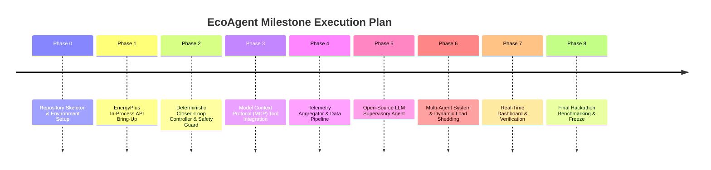

# Multi-Phase Project Execution Roadmap

## Overview

EcoAgent is structured around an 8-phase milestone execution plan. Progression between phases requires successful completion, verification, and code freeze of all preceding milestones.

---

## Phase Execution Roadmap

---

## Milestone Descriptions (Objectives Only)

### Phase 0 — Repository Foundation & Environment Setup
- **Status**: **COMPLETE & FROZEN**
- **Objectives**: Establish standard Python package layout, configuration management (`config/default.yaml`), dependency manifests, git workspace hygiene, and placeholders.

### Phase 1 — EnergyPlus API Integration & In-Process Execution
- **Status**: **COMPLETE & FROZEN**
- **Objectives**: Verify EnergyPlus v26.1.0 installation, load `pyenergyplus.api` in-process, establish weather file integration (`data/USA_CO_Golden-NREL.epw`), execute annual simulation (`data/5ZoneAirCooled.idf`), and verify callback mechanics.

### Phase 2 — Deterministic Closed-Loop Controller & Safety Guard
- **Status**: **COMPLETE & FROZEN**
- **Objectives**: Implement deterministic rule-based zone controllers, shared runtime scheduler, handle caching, per-zone Safety Guard validation, immediate readback verification, degraded mode isolation, and structured JSON-lines telemetry.

### Phase 3 — Model Context Protocol (MCP) Interface Layer
- **Status**: **PLANNED**
- **Objectives**: Expose building telemetry and setpoint modification capabilities via standardized Model Context Protocol (MCP) server tools, enabling standardized communication between AI agents and the EcoAgent control framework.

### Phase 4 — Telemetry Aggregator & Data Pipeline
- **Status**: **PLANNED**
- **Objectives**: Implement post-HVAC reporting telemetry synchronization, energy consumption accounting, thermal comfort PMV metrics computation, and time-series database exports.

### Phase 5 — Open-Source LLM Supervisory Agent Integration
- **Status**: **PLANNED**
- **Objectives**: Connect an open-source LLM supervisory agent to evaluate building state and propose high-level setpoint optimizations via MCP tools, subject to mandatory Phase 2 Safety Guard validation.

### Phase 6 — Multi-Agent Supervisory Control & Peak Load Management
- **Status**: **PLANNED**
- **Objectives**: Deploy specialized sub-agents (e.g. Comfort Agent, Energy Agent, Demand Response Agent) to negotiate zone setpoints during peak utility demand periods while maintaining thermal safety.

### Phase 7 — Operator Interface & Telemetry Dashboard
- **Status**: **PLANNED**
- **Objectives**: Build a real-time web dashboard displaying zone temperatures, setpoints, safety guard interventions, chiller power demand, and agent reasoning traces.

### Phase 8 — Final System Benchmarking & Competition Freeze
- **Status**: **PLANNED**
- **Objectives**: Perform annual baseline vs agentic energy consumption comparisons, calculate total kWh energy savings and occupant thermal comfort compliance, and freeze final hackathon submission package.
