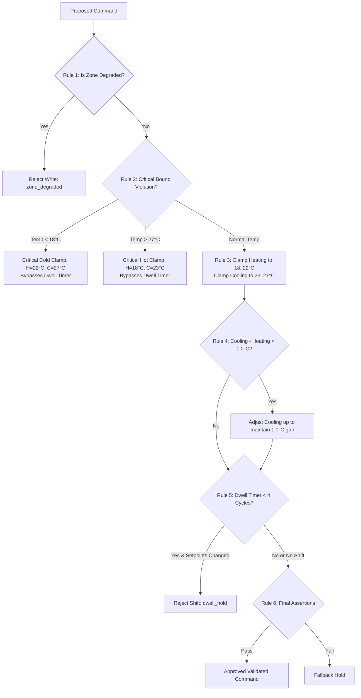

# Safety Invariants & Safety Guard

## Overview

Safety invariants are immutable constraints enforced by `ecoagent.controller.safety_guard.validate_command`. Higher-level decision layers (such as state machines or future supervisory LLMs) propose setpoints, but no command reaches EnergyPlus actuators without passing Safety Guard validation.

---

## Frozen Safety Invariants

### Invariant 1: Gatekeeping Enforcer
- **Statement**: Every actuator setpoint write must pass through the `validate_command` pure function. Direct unvalidated calls to `set_actuator_value` are prohibited.
- **Motivation**: Runtime experiments confirmed that PyEnergyPlus API does not validate written actuator floating-point values for physical feasibility or deadband compliance.

### Invariant 2: Cooling Greater Than Heating
- **Statement**: Cooling setpoint must strictly exceed heating setpoint (`cooling_sp > heating_sp`).
- **Motivation**: Preventing simultaneous heating and cooling coil actuation in terminal units.

### Invariant 3: Minimum Deadband
- **Statement**: A minimum setpoint deadband of `1.0°C` must be maintained at all times (`cooling_sp - heating_sp >= 1.0`).
- **Motivation**: Violating setpoint deadbands triggers `DualSetPointWithDeadBand` severe errors in EnergyPlus, terminating the simulation.

### Invariant 4: Heating Setpoint Bounds
- **Statement**: Heating setpoint must remain bounded within `[18.0, 22.0]°C`.
- **Motivation**: Prevents excessive space heating while guaranteeing minimum occupant freeze protection.

### Invariant 5: Cooling Setpoint Bounds
- **Statement**: Cooling setpoint must remain bounded within `[23.0, 27.0]°C`.
- **Motivation**: Prevents excessive chiller energy consumption while enforcing maximum heat-stress boundaries.

### Invariant 6: Actuator Input Validation
- **Statement**: No unvalidated, raw, or unchecked floating-point value may be passed to `set_actuator_value`.
- **Motivation**: Prevents `NaN`, `Inf`, or out-of-bounds commands from corrupting C-runtime state.

### Invariant 7: Immediate Readback Verification
- **Statement**: Every actuator write must be immediately followed by a readback check (`get_actuator_value`) within the same callback.
- **Motivation**: Confirms that setpoint memory writes took effect in EnergyPlus memory.

### Invariant 8: Exception Boundary Protection
- **Statement**: No uncaught exception raised within controller code may escape the C-API callback interface.
- **Motivation**: Unhandled Python exceptions crash the main simulation process.

---

## Safety Guard Evaluation Precedence

Rules inside `validate_command` are evaluated in strict priority order:

---

## Dwell Timer Interaction Rules

- **Dwell Period**: `4 cycles` (1 hour at 15-minute intervals).
- **Routine Transitions**: When a zone transitions between `IDLE`, `HEATING`, or `COOLING`, setpoint shifts are held if `dwell_timer < 4`.
- **Critical Clamp Exemption**: Rule 2 (Critical Cold/Hot Clamps) evaluates **before** Rule 5 (Dwell Timer) and bypasses dwell restrictions. If space temperature breaches hard physical bounds (<18°C or >27°C), emergency setpoint clamps fire immediately regardless of dwell timer status.
