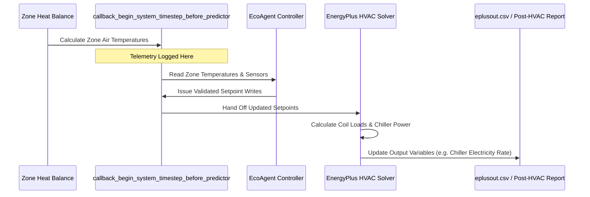

# Telemetry Schema & Logging Specification

## Overview

EcoAgent outputs structured JSON-lines records to `logs/controller_output/controller.jsonl` at each 15-minute simulation callback. This telemetry records simulation clock metadata, environmental sensors, zone states, control decisions, safety guard actions, and readback verification results.

---

## Callback Timing & Telemetry Sampling Sequence



> [!IMPORTANT]
> **Pre-Predictor Telemetry Limitation**: Telemetry is sampled inside `callback_begin_system_timestep_before_predictor`. Zone temperatures reflect current heat balance, but plant-level rate variables (e.g. `chiller_power_w`) reflect the pre-HVAC state prior to current step solver iteration. Therefore, `chiller_power_w` in `controller.jsonl` **must not be used directly for annual energy accounting or plant energy benchmarking**. Official energy accounting should utilize `eplusout.csv` post-HVAC reporting variables or corrected telemetry.

---

## Log Record Schema

### Global Event / Cycle Metadata

| Field | Meaning | Type / Units | Sampling Point | Limitations |
| :--- | :--- | :--- | :--- | :--- |
| `callback_number` | Monotonic callback counter | Integer (1..35040) | Callback start | Resets per simulation run |
| `simulated_timestamp.month` | Simulated month | Integer (1..12) | API clock | Weather file calendar |
| `simulated_timestamp.day` | Simulated day of month | Integer (1..31) | API clock | Weather file calendar |
| `simulated_timestamp.hour` | Simulated hour of day | Integer (0..23) | API clock | Weather file calendar |
| `simulated_timestamp.minute` | Simulated minute of hour | Integer (0, 15, 30, 45) | API clock | Fixed 15-min timestep |
| `warmup` | Warmup status flag | Boolean | API `warmup_flag` | Warmup steps skipped |
| `scheduler_status` | Runtime scheduler status | String (`RUNNING`, `DISABLED`) | Scheduler state | High-level status |
| `outdoor_temp_c` | Outdoor drybulb temperature | Float (°C) | Environment sensor | Weather dataset |
| `chiller_power_w` | Chiller electrical demand rate | Float (W) | Central Chiller sensor | Pre-HVAC state |
| `total_zones_active` | Count of active non-degraded zones | Integer (0..5) | Controller state | Max 5 zones |
| `total_zones_degraded` | Count of degraded zones | Integer (0..5) | Controller state | Max 5 zones |

---

### Per-Zone Array Schema (`zones[]`)

| Field | Meaning | Type / Units | Sampling Point | Limitations |
| :--- | :--- | :--- | :--- | :--- |
| `zone_name` | Thermal zone identifier | String (`SPACE1-1` .. `SPACE5-1`) | Domain key | Fixed 5 zones |
| `controller_state` | Zone state machine state | String (`IDLE`, `HEATING`, `COOLING`, `DEGRADED`) | ZoneController | Pure state label |
| `aggressive_mode` | Step-size scaling mode | Boolean (`True` = 1.0°C, `False` = 0.5°C) | ZoneController | Internal hysteresis flag |
| `temperature_c` | Measured zone air temperature | Float (°C) | Zone Air Temp sensor | Sensor floor/ceiling filter |
| `proposed_heating_sp` | Unvalidated heating setpoint proposed | Float (°C) | ZoneController | Intermediate proposed value |
| `proposed_cooling_sp` | Unvalidated cooling setpoint proposed | Float (°C) | ZoneController | Intermediate proposed value |
| `validated_heating_sp` | Validated heating setpoint | Float (°C) | Safety Guard | Passed to actuator |
| `validated_cooling_sp` | Validated cooling setpoint | Float (°C) | Safety Guard | Passed to actuator |
| `safety_guard_reason` | Safety Guard decision code | String (`approved`, `dwell_hold`, `critical_clamp_hot`, `critical_clamp_cold`) | Safety Guard | Governance audit trail |
| `actuator_written` | Setpoint write executed flag | Boolean | ActuatorManager | Write execution indicator |
| `readback_verified` | In-callback readback match flag | Boolean | ActuatorManager | Verified within 0.001°C |
| `dwell_timer` | Cycles since last setpoint shift | Integer | ZoneState | Increments every step |
| `saturation_flag` | Setpoint at bound without progress | Boolean | Orchestrator | Logged indicator only |
| `degraded` | Zone degraded status flag | Boolean | ZoneState | Isolated zone failure |

---

## Sample JSON Log Line

```json
{
  "callback_number": 100,
  "simulated_timestamp": {"month": 1, "day": 2, "hour": 1, "minute": 0},
  "warmup": false,
  "scheduler_status": "RUNNING",
  "outdoor_temp_c": -2.0,
  "chiller_power_w": 0.0,
  "total_zones_active": 5,
  "total_zones_degraded": 0,
  "zones": [
    {
      "zone_name": "SPACE1-1",
      "controller_state": "IDLE",
      "aggressive_mode": false,
      "temperature_c": 22.01,
      "proposed_heating_sp": 22.0,
      "proposed_cooling_sp": 27.0,
      "validated_heating_sp": 22.0,
      "validated_cooling_sp": 27.0,
      "safety_guard_reason": "approved",
      "actuator_written": true,
      "readback_verified": true,
      "dwell_timer": 15,
      "saturation_flag": false,
      "degraded": false
    }
  ]
}
```
